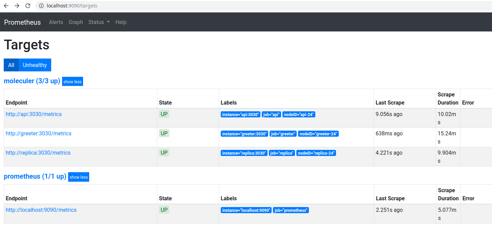

# Moleculer Microservices - (https://moleculer.services)
## Example

Run `npm run dc:up` and open [http://localhost:9090/targets](http://localhost:9090/targets). You should get something like:

### Useful Links

- [http://localhost:3000/](http://localhost:3000/) - Make a call to API Gateway
- [http://localhost:3001/dashboard/](http://localhost:3001/dashboard/) - Call Traefik
- [http://localhost:9090/graph](http://localhost:9090/graph) - Call Prometheus server
- [http://localhost:9100/metrics](http://localhost:9100/metrics) - Check `api` service metrics
- [http://localhost:9200/metrics](http://localhost:9200/metrics) - Check `greeter` service metrics